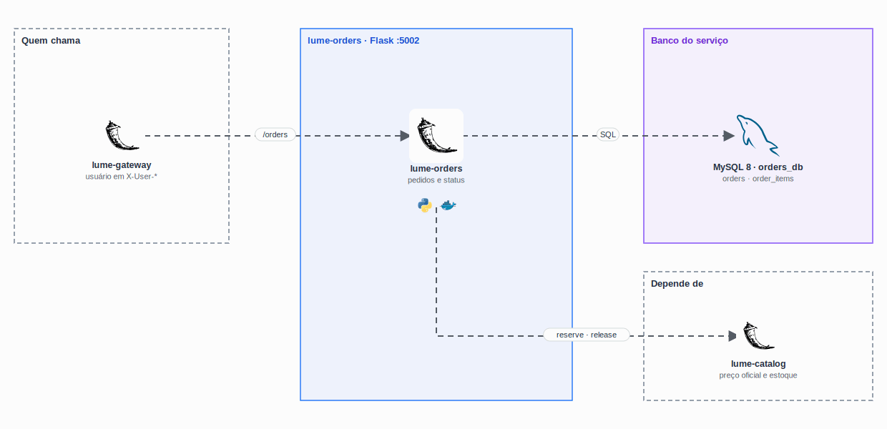

<p align="center">
  
</p>

<h1 align="center">
  Lume Store · Orders
</h1>

<p align="center">
  
</p>

<p align="center">
  <a href="https://skillicons.dev">
    
  </a>
</p>

## Qual a finalidade do projeto?

Microserviço de **pedidos** da Lume Store. Registra as compras, mantém o histórico de cada cliente e controla o ciclo de vida do pedido (`pending` → `paid` → `shipped` → `delivered`, ou `cancelled`). Para fechar um pedido, pede ao [lume-catalog](https://github.com/lume-store-org/lume-catalog) que reserve o estoque e informe os preços: **o cliente nunca define o preço**.

Tem o próprio banco MySQL (`orders_db`) e recebe o usuário autenticado do [lume-gateway](https://github.com/lume-store-org/lume-gateway) pelos headers `X-User-Id` e `X-User-Admin`.

## O que foi construído

### Rotas

| Método e rota | Acesso | O que faz |
|---|---|---|
| `GET /orders` | logado | Pedidos do cliente (admin vê todos) |
| `GET /orders/<id>` | dono ou admin | Detalhe do pedido |
| `POST /orders` | logado | Cria o pedido reservando o estoque no catálogo |
| `DELETE /orders/<id>` | dono ou admin | Cancela pedido pendente ou pago e devolve o estoque |
| `PATCH /orders/<id>/status` | admin | Muda o status |
| `GET /health` | interno | Status do serviço, do banco e do catálogo |

### Banco `orders_db`

| Tabela | Colunas principais |
|---|---|
| `orders` | `user_id`, `created_at`, `status`, `shipping_address`, `total` |
| `order_items` | `order_id`, `product_id`, `name`, `image`, `quantity`, `unit_price` |

Nome, imagem e preço ficam gravados no item do pedido: mudanças no catálogo não alteram pedidos antigos.

## Tecnologias utilizadas

- **Python 3.12 + Flask 3 + Gunicorn**;
- **MySQL 8** com `mysql-connector-python`;
- **Requests:** comunicação com o catálogo;
- **Docker:** imagem sem root, com healthcheck.

## Estrutura do repositório

```text
lume-orders/
├── app.py
├── routes.py           # Rotas de pedidos e compensação de estoque
├── database.py
├── database/init.sql   # Tabelas e um pedido de exemplo
├── requirements.txt
└── Dockerfile
```

## Fluxo de funcionamento

1. Chega `POST /orders` com `{items: [{product_id, quantity}], shipping_address}`.
2. O serviço chama `/internal/stock/reserve` no catálogo, que baixa o estoque numa transação e devolve os preços.
3. Grava o pedido e os itens com o total calculado no servidor.
4. Se a gravação falhar, chama `/internal/stock/release` para devolver o estoque. É uma **compensação**: como cada serviço tem o seu banco, não existe transação única entre eles.
5. No cancelamento, o status vira `cancelled` e o estoque volta ao catálogo.

## Variáveis de ambiente

`DB_HOST`, `DB_NAME`, `DB_USER`, `DB_PASSWORD` e `CATALOG_SERVICE_URL` (padrão `http://lume-catalog:5001`).

## Como rodar

Pelo [lume-infra](https://github.com/lume-store-org/lume-infra).

## Como validar a entrega

- pedido com `unit_price: 0.01` no corpo sai com o preço do catálogo;
- cliente só vê os próprios pedidos; o admin vê todos;
- cancelar um pedido pendente devolve o estoque;
- `PATCH /api/orders/<id>/status` como cliente devolve `403`.

## Projeto Lume Store

| Repositório | Camada |
|---|---|
| [lume-front](https://github.com/lume-store-org/lume-front) | Loja (Next.js) |
| [lume-gateway](https://github.com/lume-store-org/lume-gateway) | API Gateway (Flask) |
| [lume-users](https://github.com/lume-store-org/lume-users) | Microserviço de usuários |
| [lume-catalog](https://github.com/lume-store-org/lume-catalog) | Microserviço de catálogo |
| [lume-orders](https://github.com/lume-store-org/lume-orders) | Microserviço de pedidos |
| [lume-infra](https://github.com/lume-store-org/lume-infra) | Docker Compose com a stack completa |

## Autor

**William Alves Coelho** · [@willtechdev](https://github.com/willtechdev)
